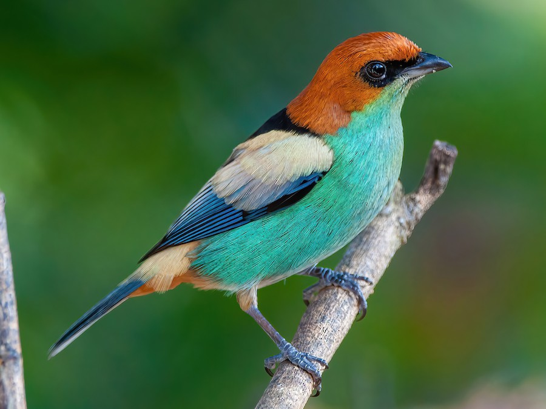
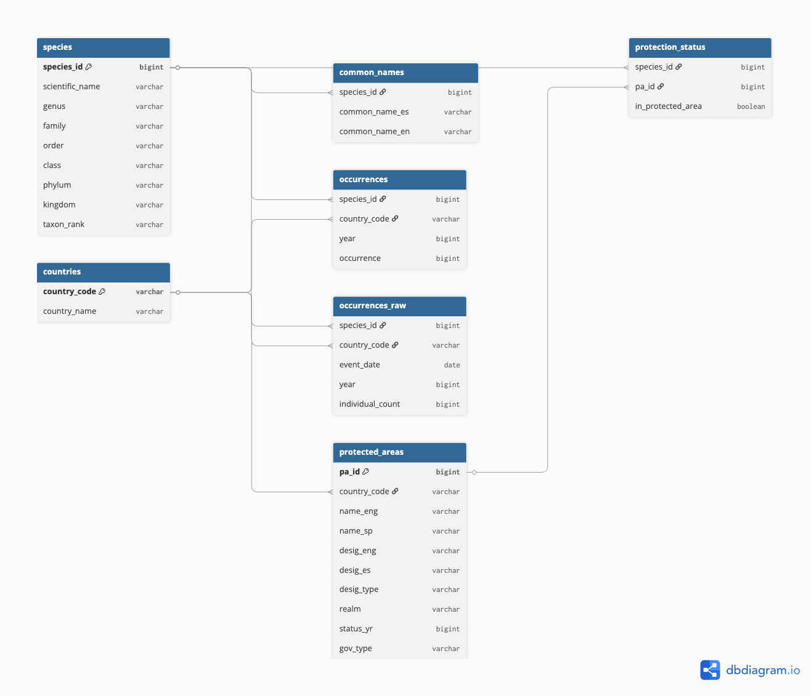

# Tracking Threatened Species: A South American Biodiversity Database

## Purpose

This repository is for a relational database on South American threatened species occurrences and protected areas. It can be used to track, visualize, and identify species occurrences within protected areas in Colombia, Brazil, Venezuela, Argentina, Chile, Peru, Bolivia, Ecuador, and Uruguay with names in both English and Spanish.



© Raphael Kurz - Aves do Sul

## Data Sources

The data for this database comes from the following places:

| Data Type | Dataset | Data Source | Data Access |
|------------------|------------------|------------------|------------------|
| Species occurrences | [Global Biodiversity Information Facility (GBIF)](https://www.gbif.org/) | Data for research-grade species occurrences. | Queried for all present, research-grade observations recorded by machine or human observation, containing coordinates, and belonging to the following [IUCN Red List](https://www.iucnredlist.org/) categories: Critically Endangered (CR), Endangered (EN), Vulnerable (VU), and Near Threatened (NT). Downloaded April 12, 2026; includes species occurrences from 1880 to present. |
| Common names | [GBIF Backbone Taxonomy](https://www.gbif.org/dataset/d7dddbf4-2cf0-4f39-9b2a-bb099caae36c#description) | Common names of species based on GBIF's backbone taxonomy — a unified classification system that enables GBIF to integrate, search, and cross-reference species names. | Common names were extracted from the `VernacularName.tsv` file included in the GBIF backbone taxonomy ZIP archive. |
| Protected areas | [World Database on Protected and Conserved Areas (WDPCA)](https://www.protectedplanet.net/en) | The most current, comprehensive database of protected areas and conservation measures, updated monthly from global contributors. | Data was downloaded for the Latin America and Caribbean region. WDPCA distributes protected area data separately for polygons and points. Three shapefiles were downloaded: `shp0` (larger polygons), `shp1` (smaller polygons), and `shp2` (points). |

## Repository Structure

```         
├── data
│   ├── processed
│   └── raw
├── environment.R
├── requirements.txt
├── figures
│   ├── bar_chart.png
│   └── map.png
├── images
│   └── black_backed_tanager_ebird.png
├── README.md
├── .gitignore
├── scripts
│   ├── data_cleaning.R
│   ├── data_ingest.sql
│   ├── data_viz.qmd
│   ├── database_query.sql
├── south-america-endangered-species-database.Rproj
└── threatened_sa.duckdb
```

**Important files**:

-   **`Data/`** Contains the raw data files, which have been added to `.gitignore`. The `processed/` subfolder contains the cleaned `.csv` files used for database ingestion.

<!-- -->

-   **`environment.R`** Script used to install and load the required R libraries and dependencies.

-   **`requirements.txt`** Saved session and package information used to reproduce the database environment.

-   **`scripts/`** Contains scripts used for data processing, ingestion, querying, and visualization:

    -   `data_cleaning.R` — imports and cleans raw data
    -   `data_viz.qmd` — visualizes database queries using `dbplyr`
    -   `data_ingest.sql` — SQL script for database ingestion
    -   `database_query.sql` — SQL script containing database queries

-   **`threatened_sa.duckdb`** The DuckDB database file containing the processed database. 

## Reproducibility
1. Clone this repository. 
2. Run the `requirements.txt` and `environment.R` to set-up environment locally. 
5. Use the database to answer questions and make fun visualizations like below!


## Database schema



## Citations

GBIF.org (12 April 2026) GBIF Occurrence Download <https://doi.org/10.15468/dl.hm9594>

UNEP-WCMC and IUCN (2026), Protected Planet: The World Database on Protected Areas (WDPA) and World Database on Other Effective Area-based Conservation Measures (WD-OECM) [Online], May 2026, Cambridge, UK: UNEP-WCMC and IUCN. Available at: www.protectedplanet.net.

GBIF Secretariat (2023). GBIF Backbone Taxonomy. Checklist dataset <https://doi.org/10.15468/39omei> accessed via GBIF.org on 2026-04-12.

## Acknowledgments
This project was completed as part of the Masters of Environmental Data Science program at the Bren School of Environmental Science and Management for [EDS 213: Databases and Data Management course](https://ucsb-library-research-data-services.github.io/bren-eds213/). 

I would like to give a special acknowledgement to the course instructors Julien Brun and Greg Janee and TA Annie Adams! 
